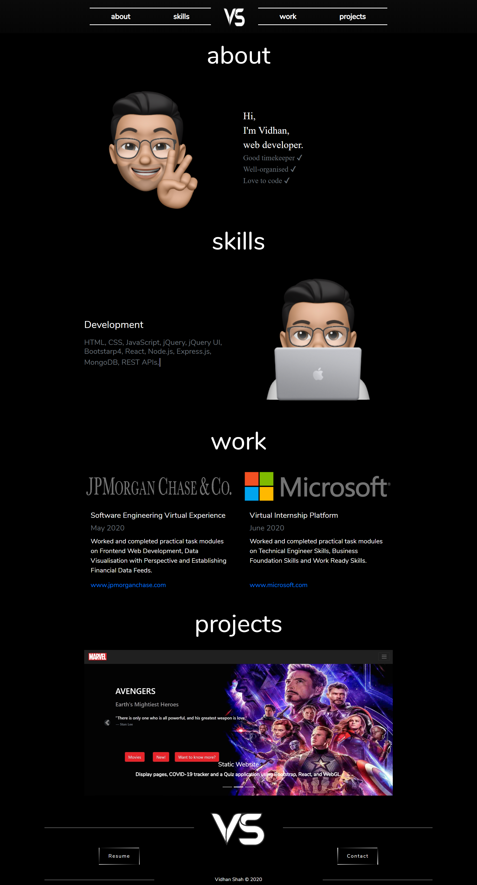
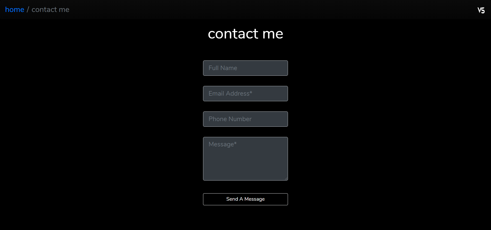
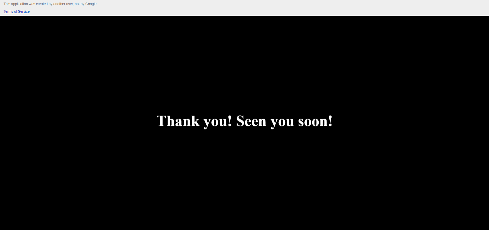
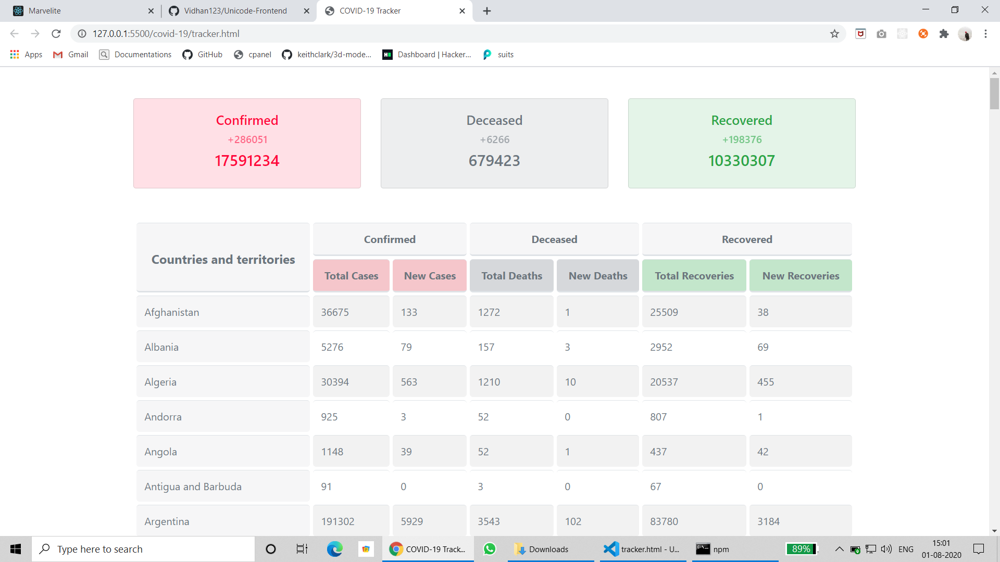
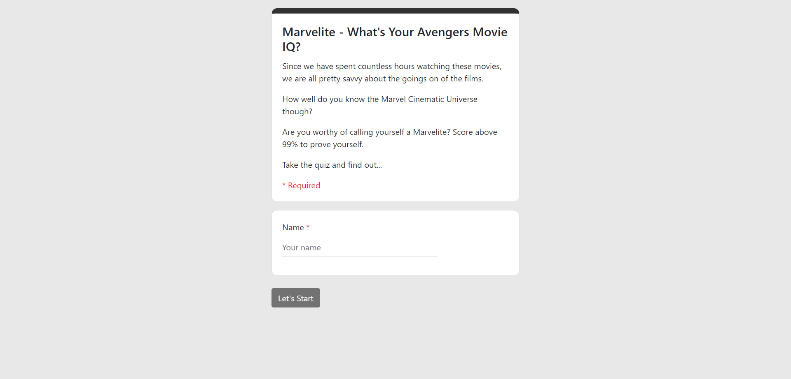
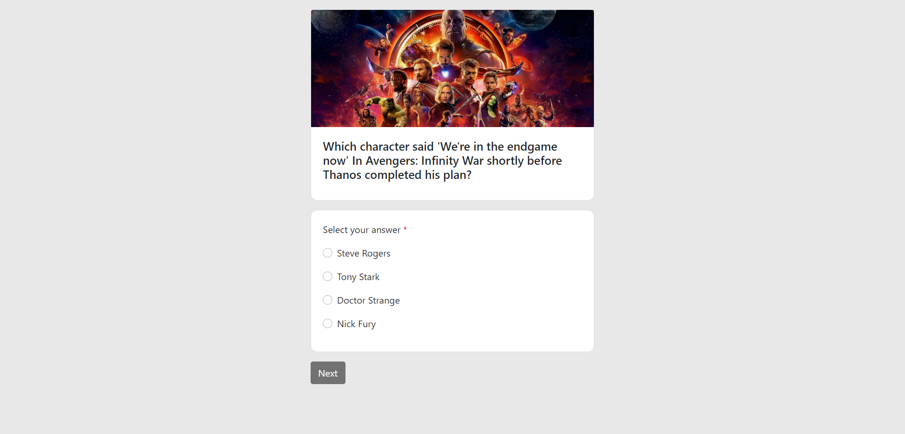
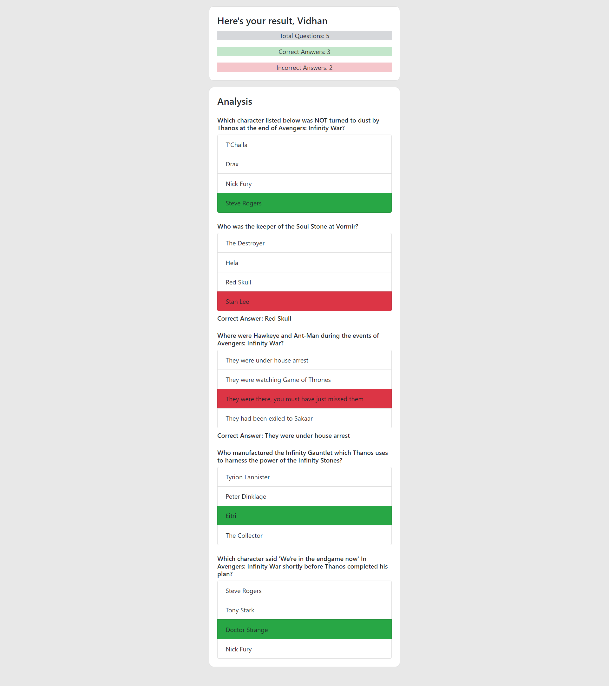

# Unicode-Frontend

Contains Portfolio website with a 'Contact Me' page, COVID-19 tracker and a Quiz app.  

1. Portfolio website: Made with HTML, CSS (and CSS animations), Bootstrap.
2. 'Contact Me' page: Does form validation using JavaScript and then sends the responses through mail.
3. COVID-19 tracker: Displays the stats related to COVID-19 from various countries by making API calls.
3. Marvelite (Quiz app): A simple quiz app made with React.

## Build Instructions

For Quiz App

```bash
cd marvelite
npm install
npm start
```

## Screenshots

### Portfolio Website



### Contact Page

#### Before submitting



#### After submitting



### COVID-19 tracker



### Quiz App

#### Start



#### Questions



#### Analysis


